<div align="center">

 

 # IFTA ya!

    

</div>

## Table of Contents

1. [Description (What, Why, and How?)](#frontend)
1. [Install (Run) with Docker](#docker)
1. [Installation without Docker](#installation)
1. [Run together with the Flask Backend (with and without Docker)](#connect_backend)
1. [Screenshots of the Frontend Next js App](#screenshots_frontend)
1. [Screenshots of the Flutter (Android + IOS) App](#screenshots_flutter)


## Description

- ### What is IFTA ya! ?

 __IFTA ya!__ is a __fast__, __simple__, and __secure__ solution for calculating and reporting IFTA Taxes. It aims to help truck owners to keep their IFTA Tax Reports up to date while in the highway or office. There is no need to pass information to third-party companies as __IFTA ya!__ has all the tools needed to fast store the information, analyze it, calculate the taxes, and create accurate reports for each truck and quarter. It also allows truck owners to manage their fleets, active drivers, and trucks.

- ### What inspired IFTA ya! ?
The IFTA Tax Report of a truck have to be calculated and reported every 3 month by the truck's owner. To do so, the truck driver (which can be the truck owner or not) has to keep all the billing information about the fuel gas added to the truck as well as all the miles traveled. This information is then given to the truck owner, and then to a Tax specialist or to an expensive Tax software company. In this process, the driver can lose days searching for the bills that are often lost, and miles are not accurate reported. Therefore, the need for an alternative, in this case, __IFTA ya!__

- ### How does IFTA ya! work ?

<div align="center">

     

</div>

__IFTA ya!__  has 3 main apps: a Next js Frontend app (this repo), a Flask Backend API (where most of the logic and calculations occur), and a Flutter app for both Android and IOS devices (that is used for the truck driver, possibly the owner operator, to input new Entries when adding Fuel or recording Miles).


__LINKS TO THE REPOSITORIES:__
- [NEXT js Frontend of IFTA ya!](https://github.com/Ceci-Aguilera/ifta_frontend) (This repo)
- [Flask Backend API of IFTA ya!](https://github.com/Ceci-Aguilera/ifta_flask_backend_api)
- The Flutter application is kept ina private repository, however screenshots of it can be found at the section [Screenshots of the Flutter (Android + IOS) App](#screenshots_flutter)


#### How do the 3 apps work together?

When an owner operator creates an account, it is possible to administrate  all the trucks, drivers, payments, and reports from the __Next js App__. The first step after registration is creating a Truck and a Driver to manage it (possibly, the owner operator itself). Then, the driver must download the __Flutter__ app from the Google Play Store (for Android) or the App Store (For IOS). The application should be used by drivers to register the amount and price of the Fuel Gallons added and amount of Miles driven. Then the __Flask__ Backend finds the quarter (based on the date) and the Tax for the fuel in each state, and with this information, it calculates and updates the IFTA Tax Report for each state visited by the driver in the truck. These changes can be visualized in the __Next js__ App by the owner of the truck. This means that if a client has 10 trucks, he can assign a Driver to each of them, and each driver then downloads the __Flutter__ app and keeps the IFTA Tax Report for the truck up to date without the client (owner of the truck) needing to do it himself.

When a driver logs in into the __Flutter__ app, the app tries to find the truck that was assigned to him by the owner operator. Therefore, each time the driver adds fuel gallons or miles, it is not needed to specify the truck that is driving, as it has been already configured. To change the current driver the owner operator can go to the __Next js__ App. Note that this method guarantees that even if a truck has multiple drivers in a quarter, its taxes can be easily deduced.

#### Notes about IFTA Taxes:

- An owner operator is a Truck driver that owns a truck.
- An owner operator can have multiple trucks and drive only one.
- A different IFTA Tax Report is presented for each truck that a client owns, that is, if a client has 10 trucks, then each truck has its own IFTA Tax Report that is independent of the others.
- Drivers do not have to present the IFTA Tax Report, as this is only a responsibility of the truck owner.
- To understand how IFTA Taxes are calculated and reported visit this [Link](https://onswitchboard.com/blog/easiest-way-to-calculate-ifta/). In reality, taxes are a bit more difficult to calculate and report as each state has its own standards and rules, however the previous link resumes the core of IFTA Taxes for a first approach.


---


<a name="docker"></a>
### Quick Installation with Docker

1. Clone the repo:

   ```bash
   git clone https://github.com/Ceci-Aguilera/ifta_frontend.git
   ```

1. Install Docker and Docker Compose

1. Configure the environment variables: Create an .env.local file inside the root folder and set up the following environment variables:

   ```text
    NEXT_PUBLIC_API_DOMAIN_NAME (The url of the backend, for example, https://backend_api.com/)
   ```

1. Run the command:

   ```bash
   docker-compose up --build
   ```

1. Congratulations =) !!! the app should be running in [localhost:3000](http://localhost:3000)

---

<a name="installation"></a>

### Custom Installation

1. Clone the repo:

   ```bash
   git clone https://github.com/Ceci-Aguilera/ifta_frontend.git
   ```

1. Install dependencies:

   ```bash
   npm install
   ```

1. Configure the environment variables: Create an .env.local file inside the root folder and set up the following environment variables:

   ```text
    NEXT_PUBLIC_API_DOMAIN_NAME (The url of the backend, for example, https://backend_api.com/)
   ```

1. Run the app

   ```bash
   npx next dev
   ```

1. Congratulations =) !!! the app should be running in [localhost:3000](http://localhost:3000)

---

<a name="connect_backend"></a>
### Run with the Flask Backend (with and without Docker)

__Note:__ Before following these steps clone this repository. From now on the selected folder that contains the clone will be referred as __project_root__. So far, it should look like this:
   ```sh
      project_root
      └── ifta_frontend
          ├── components
          ├── context
          ├── node_modules
          ├── pages
          ├── public
          ├── screenshots
          └── styles
   ```

1. Assuming that your are at the __project_root__, clone the [Flask Backend API repository](https://github.com/Ceci-Aguilera/ifta_flask_backend_api):
   ```sh
      git clone https://github.com/Ceci-Aguilera/ifta_flask_backend_api.git
   ```
   Now the __project_root__ folder should look like:
      ```sh
      project_root
      ├── ifta_frontend
      └── ifta_flask_backend_api
   ```

- #### If Using Docker and Docker Compose
   1. Copy the content of the docker-compose-connect.yml to a new file docker-compose.yml in the __project_root__. The docker-compose-connect.yml file can be found at the root of this repository and also at the root of the [Flask Backend API repository](https://github.com/Ceci-Aguilera/ifta_flask_backend_api) (Either file is fine to copy).
   1. Follow the instruction to configure the environment variables of the __Flask__ backend API that can be found in the section __Install (Run) with Docker__ in the Readme.md of the [Flask Backend API repository](https://github.com/Ceci-Aguilera/ifta_flask_backend_api)
   1. Follow the instructions on the __Install (Run) with Docker__ section of this Readme.md to configure the environment variables for this repo. The only env variable needed is the Flask Backend url, which by default should be [http://localhost:5000](http://localhost:5000).
   __Note:__ Right now the __project_root__ should look like:
         ```sh
         project_root
         ├── ifta_frontend
         ├── ifta_flask_backend_api
         └── docker-compose.yml
      ```

   1. Run the command:

      ```bash
      docker-compose up --build
      ```

   1. Congratulations =) !!! the frontend app should be running in [localhost:3000](http://localhost:3000) while the backend is at [localhost:5000](http://localhost:5000)


- #### Running without Docker and Docker Compose
   1. Follow the intructions of the __Installation without Docker__ section in the Readme.md of the [Flask Backend API repository](https://github.com/Ceci-Aguilera/ifta_flask_backend_api) to configure and run the backend.
   1. Follow the instructions of section __Installation without Docker__ of this Readme.md. Modify the NEXT_PUBLIC_API_DOMAIN_NAME to be the url of the __Flask__ Backend API (by default it is [http://localhost:5050](http://localhost:5050)).
   1. Congratulations =) !!! the frontend app should be running in [localhost:3000](http://localhost:3000) while the backend is at [localhost:5050](http://localhost:5050)


---

<a name="screenshots_frontend"></a>

### Screenshots of Selected Pages of the Frontend NEXT JS App

#### Mobile View

<div align="center">

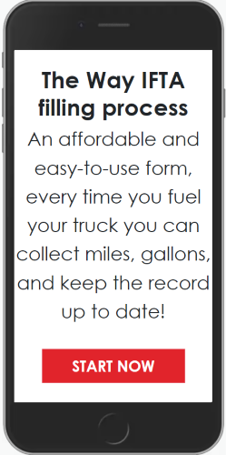 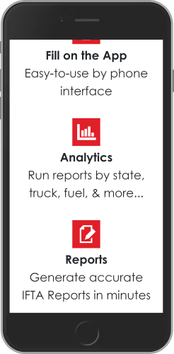 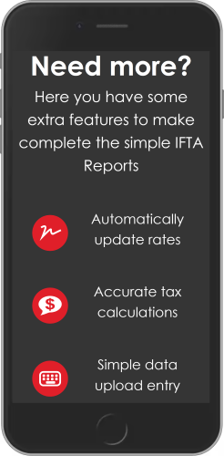

</div>

<div align="center">

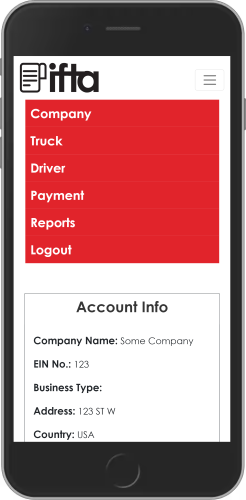 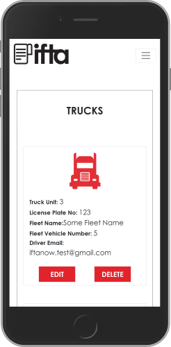 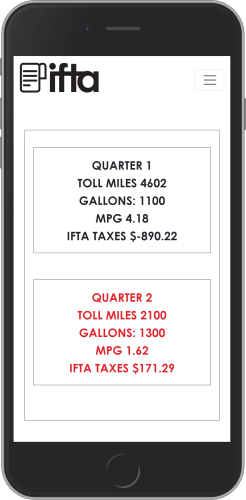

</div>
---

#### Desktop

##### View of the Landing Page


---

##### View of the Account Information Page

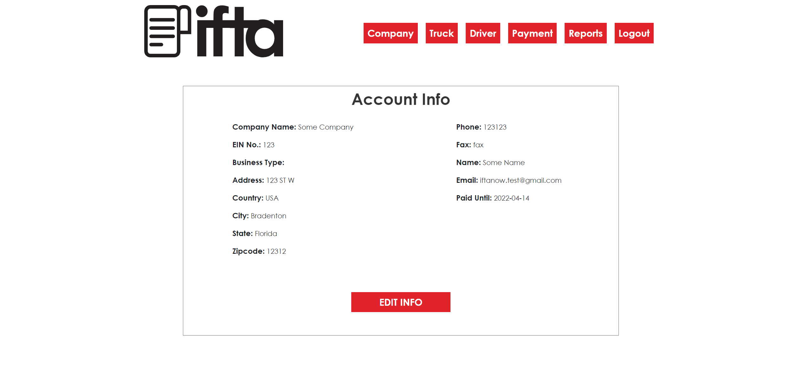

---

##### View of the Drivers Information Page when Modal is open

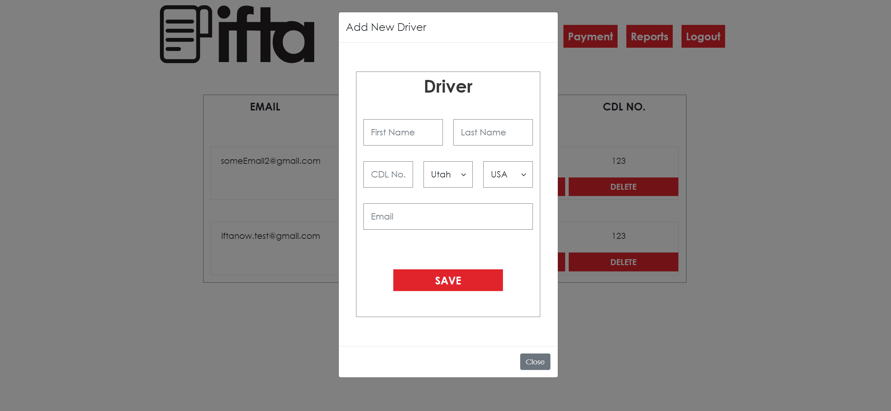

---

##### View of the Quarters Resume Page for selected Truck

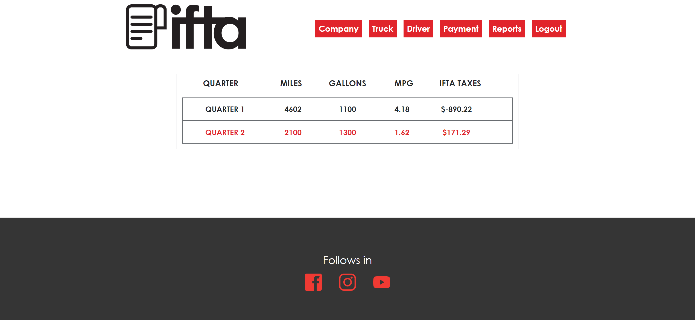

---

<a name="screenshots_flutter"></a>

### Screenshots of the Flutter (Android + IOS) App

<div align="center">

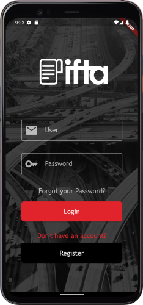 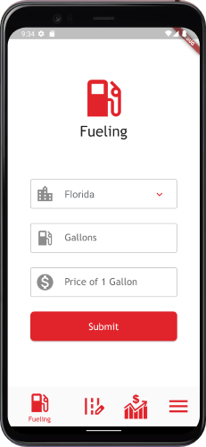 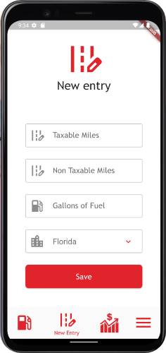

</div>

<div align="center">

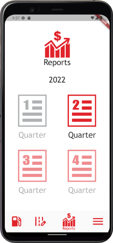 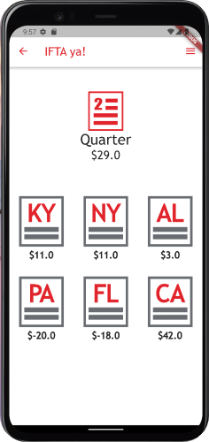 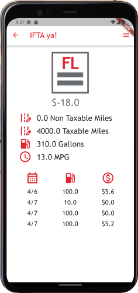

</div>